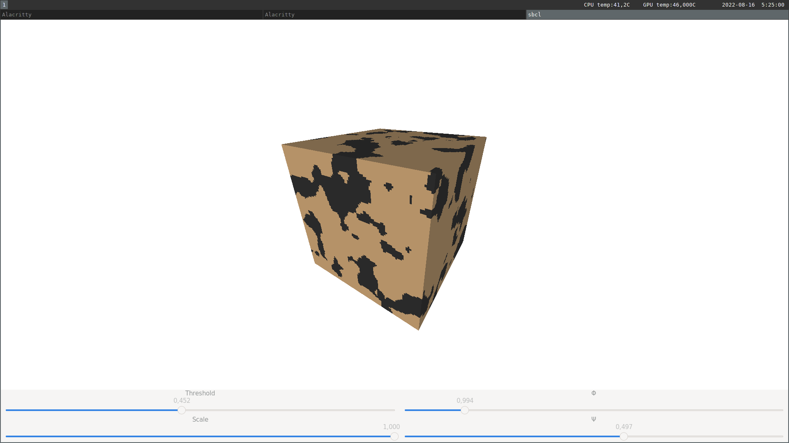

# cube-viewer

Cube viewer is a small tool for visualization of porous materials.

## Input data

Input data must be raw files which contain 3D arrays of densities with
dimensions NxNxN and 8 bits per sample. Cube viewer will show densities which
are less than a certain threshold with one color and densities which are bigger
than the threshold with another color.

## Building

The program is tested with SBCL but other Common Lisp implementations may work
as well. Install quicklisp and do the following steps from the REPL.

~~~~{.lisp}
;; Add ultralisp to your repositories
(ql-dist:install-dist "http://dist.ultralisp.org/"
                      :prompt nil)
;; Load cube-viewer
(ql:quickload :cube-viewer)
;; Build an application
(asdf:make :cube-viewer/application)
~~~~

## Usage

In a terminal invoke cube-viewer as follows:

~~~~
cube-viewer path-to-data cube-side
~~~~

i.e. for an example file `docs/example.raw`

~~~~
cube-viewer path-to-repo/docs/example.raw 100
~~~~

With `Ψ` and `Φ` sliders you can control position of the camera. `Threshold` is
used to map densities to one of two colors and with `Scale` you can look at the
interior of the array.

